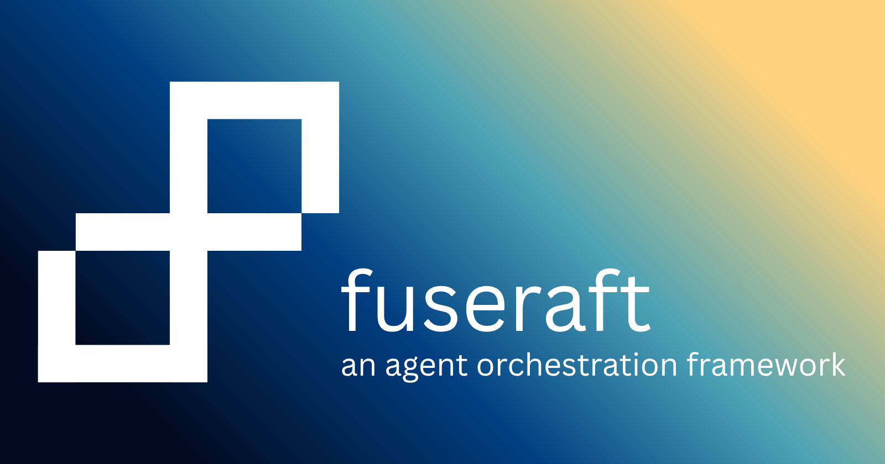

# fuseraft-server



A Blazor Server web UI for [fuseraft](https://github.com/fuseraft/fuseraft-cli) — manage agent orchestration sessions, build orchestration configs visually, handle human-in-the-loop approvals, and schedule recurring runs, all from a browser.

---

## Features

### Sessions
Start and monitor multi-agent orchestration sessions. Each session streams live agent events as they happen. Running sessions can be cancelled; completed sessions retain their full event history.

### Orchestration Builder
Build and launch orchestration configs without touching YAML directly.

- **Recent configs** — previously used orchestrations appear at the top of the template picker; select one and start a session immediately without re-generating anything
- Pick from 10 built-in templates (Dev Team, Research, DevOps, Minimal, and more)
- Edit agents visually: name, description, instructions, model override, endpoint, reasoning effort, plugins, FunctionChoice, TrustScore, MaxTokens
- Select a stored **Model Profile** per agent to populate model ID, endpoint, and reasoning effort in one click
- Save to a workspace directory and launch directly into a new session

### Model Profiles
Store model IDs, API endpoints, and API keys once — reference them from any orchestration.

- Add profiles for any provider (Anthropic, OpenAI, xAI, Google, Mistral, Ollama, …)
- API keys are stored in the OS keychain (GNOME Keyring on Linux via `secret-tool`, macOS Keychain via the `security` CLI, Windows Credential Manager via DPAPI) with a mode-600 plain-text fallback at `~/.fuseraft/profile-keys/`
- On startup, each profile's key is injected as `FUSERAFT_PROFILE_{id}_KEY` so the orchestrator resolves it automatically via `apiKeyEnvVar:` in the YAML
- Non-secret fields (name, model ID, endpoint, provider) are persisted to `~/.fuseraft/model-profiles.json`

### Plugins
Browse every registered plugin and its functions — name, description, and full function list — with a live search that filters across plugins and individual function descriptions.

### Context
Attach reference documents to a workspace. Imported files are indexed in `.fuseraft/context/` and injected into agent context at session start.

### Configs
Validate existing orchestration YAML files. The panel shows agent names, selection type, and any configuration issues (missing API key env vars, unknown selection strategies, etc.).

### Schedule
Define recurring orchestration runs on a cron schedule.

### REPL
An interactive chat interface backed by the fuseraft CLI REPL — the same engine that powers the VS Code extension and the `fuseraft repl` terminal command.

- Select any configured **Model Profile** to start a session; API keys are injected automatically from the profile store
- Full slash-command support (`/help`, `/clear`, `/compact`, `/plan`, `/execute`, `/system`, `/safe-mode`, and all other built-in commands) — handled natively by the CLI process, not re-implemented in the server
- Tool use enabled by default: FileSystem, Shell, Search, Git, and Http tools are available to the model
- Streaming tokens and tool-call badges update in real-time as the model responds
- Assistant responses are rendered as Markdown (code blocks, tables, lists, etc.)
- Sessions are persisted to `~/.fuseraft/repl-sessions/` after each turn; past sessions appear in the **Recent Sessions** table and can be resumed at any time
- Internally the server spawns `fuseraft repl --vscode --no-banner` and speaks the same JSON-line protocol (`ready`, `token`, `tool_call`, `message_end`, `plan`, `step_status`, `session_end`, …) used by the VS Code extension

### HITL (Human-in-the-Loop)
Agents can pause and request human input mid-run. The HITL panel shows pending prompts with a badge count in the nav, lets you respond or redirect, and unblocks the waiting agent automatically.

---

## Ecosystem Tools

### vsl (Vessel)
Vessel (vsl) - Mini Autonomous Software Engineering Agent (Phase 1).

**Purpose**: CLI tool for repository analysis and implementation planning using LangGraph orchestration. Complementary to fuseraft for automated SE workflows.

**Tech Stack**:
- Python 3.14, LangGraph, langchain-openai (xAI grok-4.3), Typer, pytest, uv
- State in `.vsl/` JSON

**CLI Commands** (Phase 1):
```bash
vsl analyze --repo ./sample-repo  # Analyze repo; writes .vsl/analysis.json
vsl plan --repo ./sample-repo --task "Add Redis caching to the customer lookup API"  # Generate plan; writes .vsl/plan.json
```

See `../vsl/` (task.md, pyproject.toml, vsl/ package) for source and full spec. Uses XAI_API_KEY env var. No direct runtime integration with fuseraft-cli yet.

---

## Requirements

- [.NET 10 SDK](https://dotnet.microsoft.com/download)
- `fuseraft-cli` (included as a project reference via `../fuseraft-cli/src/fuseraft.csproj`)
- Linux: `secret-tool` (from `libsecret-tools`) for keychain storage, or keys fall back to plain-text

---

## Running

```bash
dotnet run --project fuseraft-server/FuseraftServer.csproj
```

Then open [http://localhost:5000](http://localhost:5000).

The project ships with a `Properties/launchSettings.json` that sets `ASPNETCORE_ENVIRONMENT=Development`, which is required for Blazor's static web assets (including `blazor.web.js`) to be served correctly.

---

## License

MIT — see [LICENSE](LICENSE).
